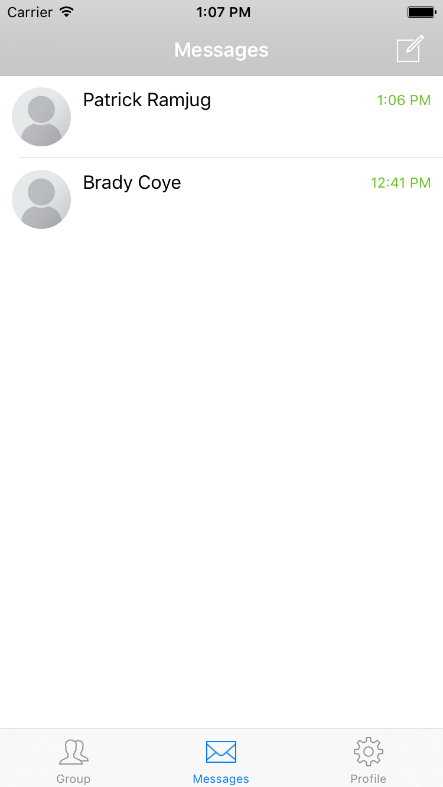
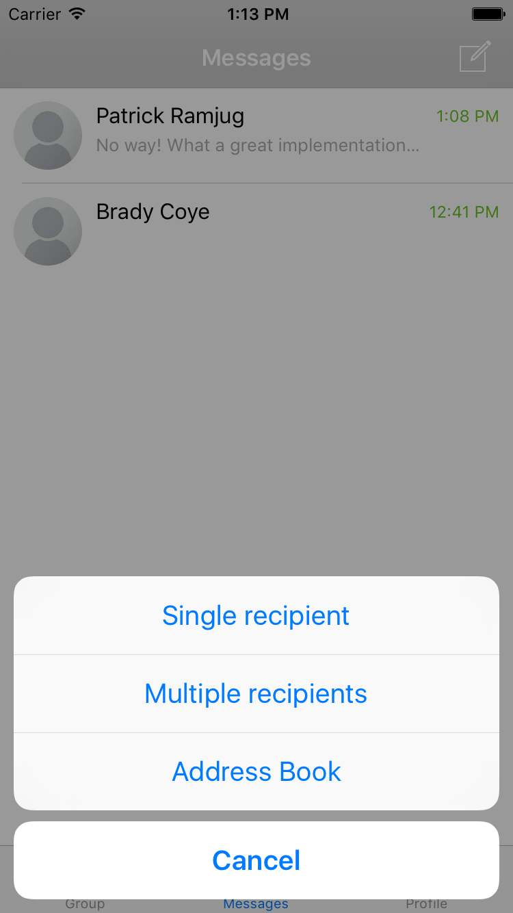
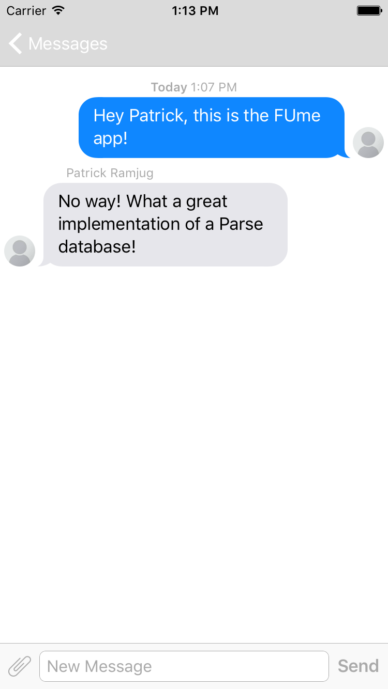
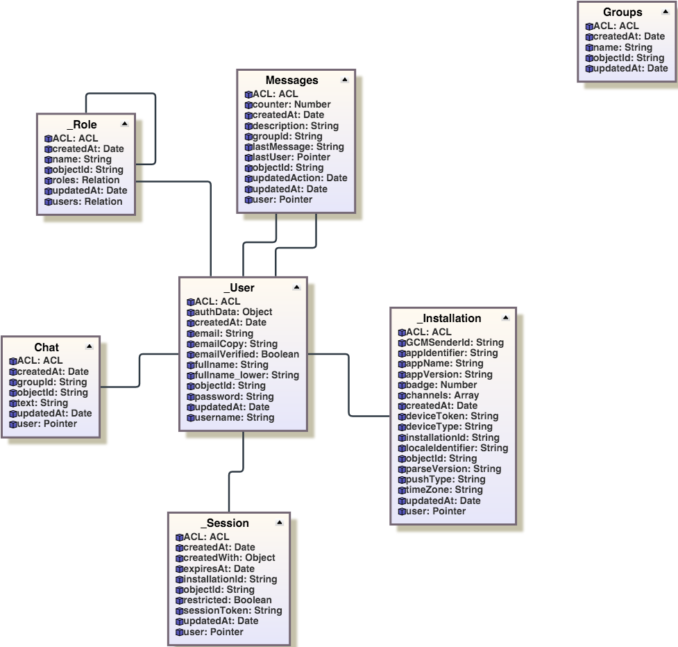

# FUme
Simple messaging app to demonstrate Parse Backend database and push notifications.

## Screenshots

## Overview
Uses https://github.com/relatedcode/NotificationChat Objective-C example. Written for my CSC-341 Database Management Systems class. Relational schema and diagram below.

